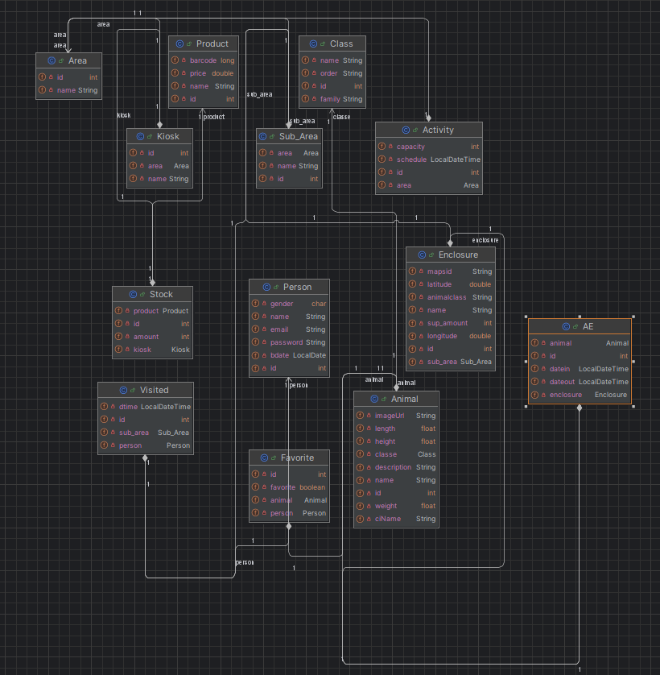
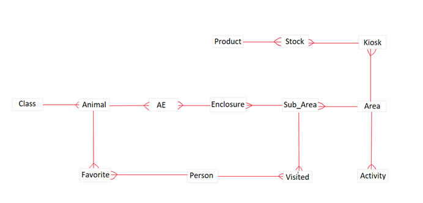

---
# Índice:
- [Curso](#curso)
- [Elementos do Grupo](#elementos-do-grupo)
- [Professores](#professores)
- [Relatório - Projeto Mobile - Zoopolis](#relatório---projeto-mobile---zoopolis)
- [Palavras-Chave](#palavras-chave)
- [Objetivos e Motivação](#objetivos-e-motivação)
- [Público-Alvo](#público-alvo)
- [Aplicações Semelhantes](#aplicações-semelhantes)
- [Guiões de Teste](#guiões-de-teste)
- [Descrição da Solução](#descrição-da-solução)
- [Project Charter](#project-charter)
- [MockUps](#mockups)
- [Planeamento (Gráfico de Gantt)](#planeamento-gráfico-de-gantt)
- [Conclusão](#conclusão)
- [Bibliografia](#bibliografia)
- [Personas](#personas)
- [Diagrama-de-Classes](#diagrama-de-classes)
- [Dicionário-de-Dados](#dicionário-de-dados)
- [Rest-API](#rest-api)

---
# Curso: 
- **Engenharia Informática** 

---
# Elementos do Grupo:

- **Bernardo Carvalho - 20231441**
- **Thiago Moreirão - 20221437**
- **David Bação - 20230331** 

**Repositório no GitHub:** https://github.com/ThZedd/Zoopolis

---
# **Professores**

**Programação Mobile** 
<br>Nathan Campos 

**Projeto Desenvolvimento Móvel** 
<br>Pedro Rosa

**Programação Orientada por Objetos** 
<br>Fabio Guilherme 

**Bases de Dados** 
<br>Miguel Boavida

**Competências Comunicacionais** 
<br>Luiza Bianquini Campos

**Matemática Discreta** 
<br>Paulo Velho


---
# Relatório - Projeto Mobile - Zoopolis

- **Zoopolis** é uma aplicação móvel concebida com o intuito de melhorar a experiência dos visitantes ao zoológico, através do fornecimento de um meio interativo e educativo para explorar as instalações. O seu objetivo é resolver a **falta de informações acessíveis** (por exemplo: a localização dos caixotes do lixo) durante a visita, oferecendo um guia digital, localização em tempo real, exibição de preços, recursos educativos e a **possibilidade de acumular pontos**, de modo a maximizar o aproveitamento da visita. 

---
# Palavras-Chave

- Aplicação Móvel, zoológico, interação, educação, turismo, colheita de pontos, guia digital, localização em tempo real.

---
# Objetivos e Motivação

### Motivação:

- Com a crescente digitalização dos espaços culturais e educativos, os zoológicos têm a oportunidade de melhorar a experiência dos seus visitantes. A nossa aplicação **Zoopolis** pretende tornar essas visitas mais cativantes e informativas, principalmente para o público jovem, através da combinação de entretenimento e educação.

### Objetivos:

 - Oferecer uma experiência cativante e interativa, com a colheita de pontos, um guia digital e localização em tempo real.
 - Incentivar as visitas recorrentes ao zoológico e o aprendizado sobre as espécies através de um guia digital.
 - Facilitar a visita ao zoo com uma interface intuitiva e de fácil acesso.

---
# Público-Alvo

- **Estudantes** interessados na vida animal;
- **Turistas** que visitam o zoológico pela primeira vez;
- **Famílias** com crianças em idade escolar;
- **Amantes de animais** que desejam de aprender mais acerca de animais.

---
# Aplicações semelhantes

Após uma pesquisa acerca de aplicações disponíveis no mercado, deparamo-nos com várias apps para zoológicos, tais como:

1. **ZSL London Zoo App:** Aplicação de guia e mapa interativo com informações sobre os animais e as atrações do zoológico de Londres.
2. **San Diego Zoo:** Oferece informações detalhadas sobre os animais e eventos, além de notificações em tempo real.
3. **Bronx Zoo App:** Além de funcionar como guia interativo, proporciona uma experiência de navegação com mapas detalhados, informações sobre os animais e suporte para planejar visitas, incluindo horários de alimentação e eventos especiais.

Estas aplicações oferecem várias funções básicas, tais como, mapas e guias, mas a Zoopolis pretende diferenciar-se com a colheita de pontos.

---
# Guiões de Teste

### Caso de Utilização Principal: Visita Guiada (Core)

1.  O utilizador faz login ou cria uma conta;
2.  **Introduz o código**, que estará disponibilizado no bilhete, e inicia a sua visita ao zoo;
3. Acede ao menu dos animais e **seleciona o animal** que deseja visitar;
4. Recebe informações detalhadas e curiosidades acerca do animal, e o **trajeto necessário** a efetuar até chegar a esse animal;
5. Após chegar ao recinto desse animal irá se deparar com uma placa com uma foto do animal, algumas informações sobre o mesmo e um **QR Code**, que poderá scannear;
6. Ao scannear esse **QR Code** esse animal aparece durante aquela visita como **"Visitado"** e o utilizador **ganha 1 ponto**;
7. Esses pontos podem ser acumulados, e ao fim de juntar um determinado número de pontos poderá levantar num dos kiosks um brinde.

### Casos de Utilização Secundários:

#### - Compra de Bilhetes:

1.  O utilizador faz login ou cria uma conta;
2. Acede ao menu dos preços e **seleciona a opção** de "Buy Tickets";
3. Seleciona o tipo de bilhete e o número de entradas;
4. Conclui a compra através de um **pagamento seguro**.

#### - Pesquisa Informativa:
1. O utilizador pode selecionar a opção de **entrar como convidado**;
2. Seleciona o **menu dos animais**;
3. Pesquisa sobre o **animal que deseja**;
4. Seleciona (caso este exista no zoológico) e obterá informações sobre o mesmo.

---
# Descrição da solução

#### 1. Descrição Genérica:

- A solução será criar uma **aplicação móvel** que oferece uma **experiência interativa, educativa e divertida** para os visitantes do zoológico. Inclui funcionalidades como **mapa interativo**, **colheita de pontos**, **compra de bilhetes**, **informação e curiosidades** acerca dos animais do zoológico e **localização em tempo real**.

#### 2. Enquadramento nas Unidades Curriculares:

- **Programação Mobile:** Desenvolvimento da aplicação móvel através da utilização da aplicação **Android Studio**.
- **Programação Orientada por Objetos:** Interligação da **base de dados** com a app através da utilização do **Spring Boot**.
- **Base de dados:** Armazenamento das **informações dos animais, utilizadores e dos pontos coletados**.
- **Competências Comunicacionais:** Comunicação eficaz na **propaganda e divulgação** do produto em desenvolvimento.
- **Matemática Discreta:** Análise e tratamento dos dados da aplicação.

#### 3. Requisitos Técnicos:

- **Linguagens de Programação**: **Kotlin**, **Java**, **MySQL**.
- **Plataforma de Desenvolvimento**: Android Studio
- **Base de Dados:** MySQL Workbench.
- **API:** Spring Boot. 

#### 4. Arquitetura da Solução:

- **Frontend:** Desenvolvimento da aplicação com Android Studio.
- **Backend:** Utilização de Spring Boot para lidar com as interações entre a base de dados e a aplicação.
- **Base de dados:** Utilização de MySQL Workbench para criar a DB.

#### 5. Tecnologias a utilizar:

- **Frontend:** Kotlin.
- **Backend:** Java.
- **Base de dados:** MySQL.

---
# Project Charter

## 1. General Project Information

- **Charter Date**: 18 October 2024

- **Project Name**: Zoopolis

- **Project Managers**: Thiago Moreirão, David Bação, Bernardo Carvalho

- **Expected Start Date**: 10 October 2024

- **Expected Completion Date**: 12 January 2025

## 2. Project Details

- **Zoopolis** is a mobile application designed to improve the experience of zoo visitors by    providing an interactive and educational means to explore the facilities.The reason we chose the Zoo is for people to have greater contact with nature, since nowadays, technology has given us such comfort that we forget how good nature is for us and what it provides us.

## 3. Key Requirements

1. **Database:** MySQL for data storage, connected to the backend via REST API.
2. **UI/UX Design:** User interface designed in Figma, following Material Design guidelines for a fluid and modern experience.
3. **Mobile Programming:** Developed in Kotlin using the Android SDK, with Retrofit for server communication.
4. **Backend Programming:** Backend developed in Java, with RESTful APIs to manage data and communicate with the database.
5. **Platform:** Native Android app, compatible with devices running Android 5.0 (Lollipop) or higher.

## 4. Expected Benefits

1. **Improved Visitor Experience:** The application offers interactive features such as a map and information about animals, providing a more educational and engaging visit.
2. **Simplified Access:** Purchasing tickets and planning visits through the app makes the experience more convenient, avoiding queues and offering real-time information.
3. **Increased Engagement:** Multimedia and interactivity features increase visitor engagement, encouraging more frequent visits and greater connection with the zoo.
4. **Ease of Management:** The zoo can monitor visitation patterns, send push notifications and reduce operational costs by digitizing most of its operations.
5. **Sustainability:** Digitizing information reduces the use of paper and helps preserve the environment, aligning with the zoo's conservation objectives.
## 5. Estimated Costs & Resources

- **Estimated Costs**: $3000

- **Resources**: $450
## 6. Estimated Milestones

1. **UI/UX Design** - November 20
2. **Database** - December 13
3. **Mobile Programming** - December 20
4. **Backend Programming** - December 29
## 7. Project Team

- Developers:
   - Bernardo Carvalho;
   - Thiago Moreirão;
   - David Bação;
## 8. Stakeholders

- **European University - IADE**

## 9. Overall Project Risk
  
- **Risks:**
   - Due to the limited time to complete the project, there is a risk that we will not be able to implement all the desired functionalities.
   - Users' lack of familiarity with the new system can result in low use and dissemination, compromising the success of the project.

- **Mitigations:**
   - Conduct development and brainstorming sessions with the team to prioritize essential features and ensure better project planning.
   - Collect feedback from a group of beta users during the testing phase to identify areas for improvement and promote acceptance of the system.

## 10. Project Success Criteria

- If all the features are working and public acceptance is favorable, we thought about communicating with the Lisbon Zoo to find a possible partnership, where we would publicize our work and implement it in a real situation.
---
# MockUps:

A aplicação utilizada foi o Figma:

- https://www.figma.com/proto/HtLBeDXc9heSYg3r913Lhk/Projeto?node-id=0-1&t=GbXDCTrreYVTK9H9-1

---
# Planeamento (Gráfico de Gantt):

Utilizamos o site recomendado para a realização do Gráfico de Gantt:

- https://sharing.clickup.com/9012393636/g/8cjwdn4-372/gantt

- https://sharing.clickup.com/9012393636/l/8cjwdn4-332/list

---

# Conclusão:

- O nosso projeto **Zoopolis** tem como objetivo revolucionar as visitas ao zoológico e a forma como as pessoas interagem com o zoo, utilizando tecnologias modernas como **a localização em tempo real**. Queremos criar uma **experiência educativa e cativante**, contribuindo para a preservação da vida selvagem, sensibilizando os visitantes. Ao longo do desenvolvimento da aplicação, **estaremos abertos a críticas construtivas**, de forma a atender às necessidades dos nossos utilizadores, garantindo assim que a nossa aplicação seja **intuitiva, funcional e prática**.


---
# Bibliografia:

- [ZSL London Zoo - London Zoo](https://www.zsl.org/) 
- [Bronx Zoo](https://map.bronxzoo.com/home) 
- [San Diego Zoo App - San Diego Zoo](https://play.google.com/store/apps/details?id=com.seamgen.sandiegozoo.zoo&hl=en&pli=1) 
- [Jardim Zoológico de Lisboa](https://www.zoo.pt)
- [Figma - Figma, Inc.](https://www.figma.com/)
- [ClickUp](https://www.clickup.com/)
- [Kotlin - Jetbrains](https://kotlinlang.org/)
- [Jetpack Compose - Google](https://developer.android.com/compose)
- [Android Studio - Google](https://developer.android.com)
- [Google Maps API - Google](https://developers.google.com/maps)
- [Java - Oracle](https://www.java.com/)
- [Spring Boot - VMware Tanzu](https://spring.io)
- [MySQL - Oracle](https://www.mysql.com/)
- [Android SDK 28 - Google](https://developer.android.com/tools/releases/platforms#9.0)

---
# Personas

 - **Nome:** Lucas Silva
- **Idade**: 27 anos
- **Profissão**: Desenvolvedor de software
- **Localização**: Mora em um apartamento na cidade, próximo ao zoológico
- **Status Familiar**: Solteiro, mas frequentemente visita com amigos ou sobrinhos

#### **Perfil e Comportamento**

Lucas é apaixonado por tecnologia e natureza. Cresceu a assistir documentários sobre animais e sempre gostou de explorar lugares que combinam aprendizado com lazer. Ele utiliza aplicativos para maximizar suas experiências e valoriza recursos tecnológicos como localização em tempo real e interação online. Apesar de visitar o zoológico ocasionalmente, ele está sempre em busca de algo novo, como eventos ou experiências exclusivas.

#### **Objetivos ao usar o app**

- Descobrir experiências únicas: eventos, habitats imersivos e exposições interativas.
- Interagir com a tecnologia do zoológico, como quiosques digitais, acumulo de pontos e localização em tempo real.
- Compartilhar momentos no zoológico nas redes sociais.

#### **Frustrações e Desafios**

- Falta de inovação em passeios típicos.
- Informações desatualizadas sobre eventos ou atrações fechadas.
- Longas filas ou dificuldades em encontrar o caminho no zoológico.

#### **Motivações**

- Explorar e aprender sobre animais de forma dinâmica e tecnológica.
- Usar o app para simplificar a visita e evitar contratempos.
- Criar conexões com a natureza e promover a conservação ambiental.

---

**Nome:**Ana Clara
- **Idade**: 35 anos
- **Profissão**: Professora de biologia no secundário
- **Localização**: Cidade grande, a 40 km do zoológico
- **Status Familiar**: Casada, mãe de duas crianças (7 e 10 anos)

#### **Perfil e Comportamento**

Ana Clara é apaixonada por natureza e está sempre procurando atividades educativas e divertidas para seus filhos. Gosta de planejar passeios antecipadamente e valoriza recursos que tornam a experiência mais interativa e informativa. Usa tecnologia para organizar suas atividades, como aplicativos e sites, mas prefere interfaces simples e intuitivas.

#### **Objetivos ao usar o app**

- **Planejar a visita**: Quer saber horários, preços, mapa do zoológico, atrações e eventos especiais.
- **Educar os filhos**: Busca informações sobre os animais que vão visitar, como curiosidades, habitat natural e hábitos alimentares.
- **Interatividade**: Gostaria de interagir com o zoológico mesmo após a visita, como receber atualizações sobre os animais.

#### **Frustrações e Desafios**

- Perder tempo com informações desorganizadas ou difíceis de acessar.
- Falta de clareza sobre o que esperar do passeio (exemplo: eventos lotados ou ausência de atrações específicas no dia).
- Dificuldade em manter as crianças engajadas durante o passeio.

#### **Motivações**

- Ensinar aos filhos a importância da conservação da natureza.
- Proporcionar momentos de lazer e conexão familiar.
- Descobrir novidades no zoológico e compartilhar com a comunidade escolar.
---
# Diagrama de Classes
 

---


# Dicionário de dados
## Modelo Entidade-Relação

  <t> 

 O relacionamento com a pessoa (Person) é central no modelo. Cada pessoa pode visitar diferentes subáreas do local (Sub Area), registrando suas preferências e comportamentos durante a sua visita. Algumas dessas pessoas podem indicar também um animal favorito
(Favorite), estabelecendo um vínculo que ajuda na personalização da experiência e na análise de tendências do interesse do público.
Os animais (Animal) estão organização em diferentes classes (Class), como mamíferos, aves ou répteis, permitindo uma categorização eficiente de acordo com suas características biológicas. Esses animais também estão alojados em recintos específicos 
(Enclousures), que atendem às necessidades de cada espécime. Cada recindo também está localizado em uma subárea (SubArea), que é uma parte de uma área maior que é o zoológico, permitindo a organização do espaço em setores bem definidos. As áreas (Area) também 
desempenhas outras funções importantes, pois incluem diferentes tipos de atividades (Activity) realizadas em diversos locais, como passeios, brincadeiras e interações com os animais. Além disso, às áreas contêm quiosques (Kiosks), que oferecem produtos para os 
visitantes e também conta com o sistema derecompensa por pontos adquiridos na visita. Esses quiosques mantêm um controle de estoque (Stock) de produtos, como alimentos, bebidas e brinquedos. Com esse modelo, não é apenas fácil de organizar como também gerir o 
zoológico, já que podemos saber todas as informações sobre os locais mais visitados além de gerir bem os produtos e serviços prestados em cada local.

## Documentos de referência 

[Dicionário de dados](Documents/Segunda_entrega/Zoopolis_Base_de_Dados_.pdf) 

[Guia de dados](Documents/Segunda_entrega/Guia_de_Dados.pdf) 

---

# REST API

#### **Introdução**

A API do Zoopolis oferece acesso eficiente a informações sobre animais, os pontos dos usuários e localização dos recintos, permitindo consultas, visualizações e recolhas de informações. Desenvolvida para integração com a aplicação móvel, a API fornece os dados atualizados e é compatível várias outras plataformas.

Os dados são entregues em formato JSON, garantindo respostas consistentes e facilitando a integração com diversos sistemas. A estrutura dos dados e os Endpoints são flexíveis, projetados para suportar futuras atualizações e melhorias contínuas na aplicação.

#### **Endpoints**
- Mostrar Animais

	 - **URL:**

	 `/animals`

	- **METHOD:**

	 `GET`

	- **SUCESS RESPONSE:**
	
```
[
  {

	"id": [integer],
	"name": [string],
	"ciName": [string],
	"description": [string],
	"weight": [float],
	"height": [float],
	"length": [float],
	"classe": {
	      "id": [integer],
	      "name": [string],
	      "order": [string],
	      "family": [string]
	    },
	"imageUrl": [string]
  },
]
```

- **ERROR RESPONSE:**

```
{
	"status": 500,
	"message": "An unexpected error occurred.",
	"timestamp": [datetime]
}
```

- **SAMPLE CALL:**
	
```

@Get("animals")
suspend fun getAnimals(): Flow<Result<List<AnimalDTO>>>

```
- Mostrar Animais por ID

	 - **URL:**

	 `/animals/:id`

	- **METHOD:**

	 `GET`
	 
	 - **URL Paramethers:**
		 - Required:
		 
		 `id: [integer]`

	- **SUCESS RESPONSE:**
	
```
[
  {

	"id": [integer],
	"name": [string],
	"ciName": [string],
	"description": [string],
	"weight": [float],
	"height": [float],
	"length": [float],
	"classe": {
	      "id": [integer],
	      "name": [string],
	      "order": [string],
	      "family": [string]
	    },
	"imageUrl": [string]
	  },

]
```

- **ERROR RESPONSE:**

```
{
	
	"status": 404,
	"message": "Animal with id {id} not found.",
	"timestamp": [datetime]
	
}
```

- **SAMPLE CALL:**
	
```

@Get("animals/{id}")
suspend fun getAnimalsById(id: Int): Flow<Result<AnimalDTO>>

```

- Mostrar Users

	 - **URL:**

	 `/persons`

	- **METHOD:**

	 `GET`

	- **SUCESS RESPONSE:**
	
```
  {

	"id": [integer],
	"name": [string],
	"email": [string],
	"password": [string],
	"gender": [char],
	"points": [integer]
   },

```

- **ERROR RESPONSE:**

```
{
	"status": 500,
	"message": "An unexpected error occurred.",
	"timestamp": [datetime]
}
```
- Mostrar Users por ID

	 - **URL:**

	 `/persons/:id`

	- **METHOD:**

	 `GET`
	 
	 - **URL Paramethers:**
		 - Required:
		 
		 `id: [integer]`

	- **SUCESS RESPONSE:**
```
[
  {

	"id": [integer],
	"name": [string],
	"email": [string],
	"password": [string],
	"gender": [char],
	"points": [integer]
	},

]
```
- **ERROR RESPONSE:**

```
{
	
	"status": 404,
	"message": "Person with id {id} not found.",
	"timestamp": [datetime]
	
}
```
- Registrar um Novo Usuário

	 - **URL:**

	 `/api/persons/register`

	- **METHOD:**

	 `POST`
	 
	 - **URL Paramethers:**
		 - Required:
		 
		 `name: [string]`
		 
		 `email: [string]`

	- **SUCESS RESPONSE:**
```
  {
	 "id": [integer],
	"name": [string],
	"email": [string],
  },
```

- **ERROR RESPONSE:**

```
{
	
	"status": 409,
	"message": "Email already in use",
	"timestamp": [datetime]
	
}
```
- Fazer Login

	 - **URL:**

	 `/api/persons/login`

	- **METHOD:**

	 `POST`
	 
	 - **URL Paramethers:**
		 - Required:
		 
		 `email: [string]`
		 
		 `password: [string]`

	- **SUCESS RESPONSE:**
```
  {
	 "id": [integer],
	"token": [string]
  },
```

- **ERROR RESPONSE:**


```
{
	
  "status": 401,
  "message": "Invalid password",
  "timestamp": [datetime]
	
}
```

- Validar Token JWT

	 - **URL:**

	 `/api/persons/validate`

	- **METHOD:**

	 `GET`

	- **SUCESS RESPONSE:**
```
  {
	 "Token is valid"
  },
```

- **ERROR RESPONSE:**


```
{
  "status": 401,
  "message": "Invalid or expired token",
  "timestamp": [datetime]
}

```
